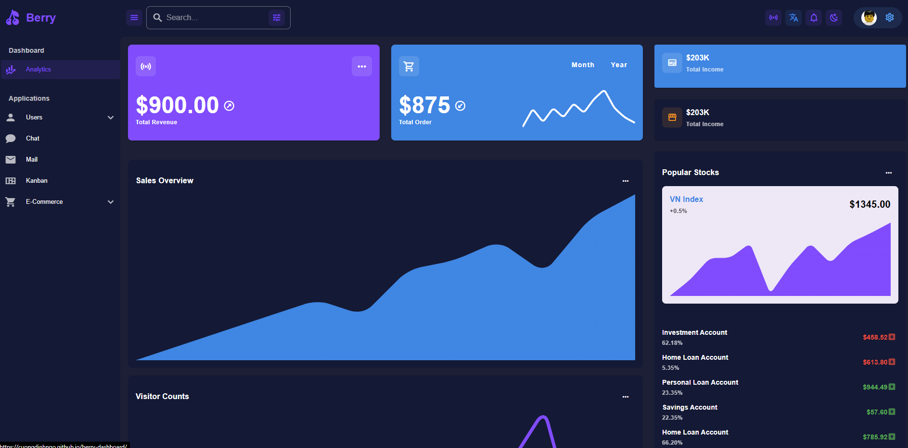
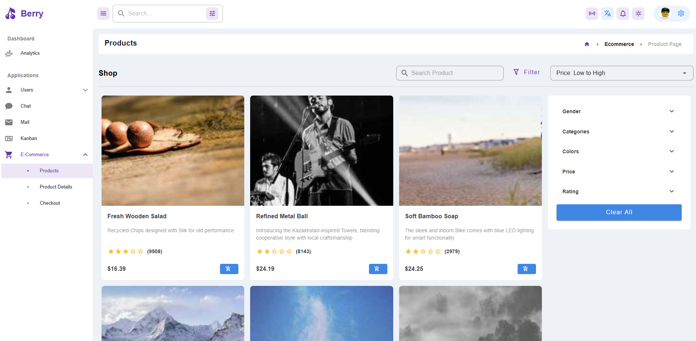
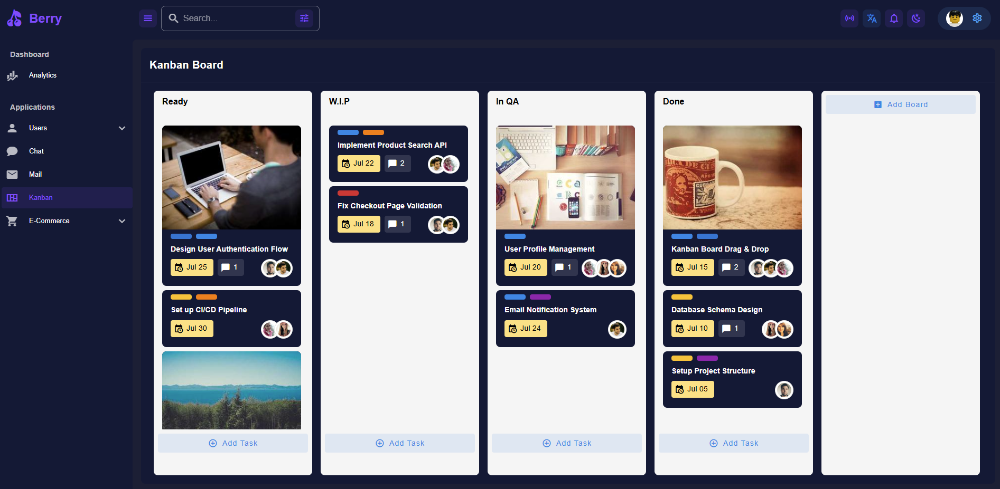

# 🍒 Berry Dashboard

A modern, responsive admin dashboard built with **Nuxt 3**, **Vue 3**, and **Vuetify 3**. Berry Dashboard provides a comprehensive set of UI components and layouts perfect for building professional web applications.


## 🌐 Live Demo

🚀 **[View Live Demo](https://cuongdinhngo.github.io/berry-dashboard/)** 

> Experience the full functionality of Berry Dashboard with interactive components, responsive design, and all features in action.

## 📸 Screenshots

### Dashboard Overview

*Main dashboard with analytics charts, statistics cards, and interactive components*

### E-commerce Product Catalog

*Product listing with advanced filtering, responsive grid, and shopping cart functionality*

### Kanban Project Management

*Drag-and-drop kanban board with task management and team collaboration features*

### Social Profile & Chat

*User profiles with social interactions, real-time chat, and communication features*

## ✨ Features

### 🎨 **Modern UI/UX**
- Custom "Berry" theme with Material Design 3
- Responsive design that works on all devices
- Light/Dark theme support
- Beautiful animations and transitions
- Custom color palette and typography

### 📊 **Dashboard Analytics**
- Interactive charts and data visualization
- Tabbed content for different time periods
- Progress indicators and KPI metrics

### 👥 **User Management**
- Complete user profile management
- Social media-style posts and interactions
- Multi-tab interface for user data

### 🛒 **E-commerce Components**
- Advanced product filtering system
- Product gallery with image zoom
- Shopping cart functionality
- Responsive product grid layout

### 📋 **Project Management**
- Kanban board with drag-and-drop
- Task management with labels
- Team member assignments
- Progress tracking

### 💬 **Communication Features**
- Chat interface
- Email management system

## 🚀 Tech Stack

- **Frontend Framework:** Nuxt 3 (Vue.js 3)
- **UI Library:** Vuetify 3
- **Language:** TypeScript
- **Styling:** SCSS with custom theming
- **Icons:** Material Design Icons
- **Charts:** Chart.js with Vue-ChartJS
- **Mock Data:** Faker.js
- **Package Manager:** Bun
- **Build Tool:** Vite (via Nuxt)

## 📱 Pages & Features

### Dashboard
- Analytics overview with charts
- Statistics cards with hover effects
- Sales data visualization
- Performance metrics

### Applications
- **Users**: Social profiles, account management, user cards
- **Chat**: Messaging interface
- **Mail**: Email management system
- **Kanban**: Project management board

### E-commerce
- **Products**: Catalog with advanced filtering
- **Product Details**: Individual product pages
- **Checkout**: Shopping cart and payment flow

## 🛠️ Installation & Setup

### Prerequisites
- Node.js 18+ or Bun runtime
- Git

### Quick Start

1. **Clone the repository**
```bash
git clone https://github.com/cuongdinhngo/berry-dashboard.git
cd berry-dashboard
```

2. **Install dependencies**
```bash
# Using Bun (recommended)
bun install

# Or using npm
npm install

# Or using pnpm
pnpm install

# Or using yarn
yarn install
```

3. **Start development server**
```bash
# Using Bun
bun run dev

# Or using npm
npm run dev

# Or using pnpm
pnpm dev

# Or using yarn
yarn dev
```

4. **Open your browser**
Navigate to `http://localhost:3000` to see the application.

## 🏗️ Build & Deployment

### Build for Production

```bash
# Using Bun
bun run build

# Or using npm
npm run build
```

### Preview Production Build

```bash
# Using Bun
bun run preview

# Or using npm
npm run preview
```

### Generate Static Site

```bash
# Using Bun
bun run generate

# Or using npm
npm run generate
```

## 📁 Project Structure

```
berry-dashboard/
├── 📁 assets/              # SCSS files and static assets
├── 📁 components/          # Reusable Vue components
│   ├── 📁 account/         # User account components
│   ├── 📁 ecom/           # E-commerce components
│   ├── 📁 item/           # Generic UI components
│   ├── 📁 kanban/         # Kanban board components
│   ├── 📁 section/        # Layout sections
│   └── 📁 user/           # User-related components
├── 📁 config/             # Configuration files
├── 📁 layouts/            # Nuxt layouts
├── 📁 pages/              # Application pages/routes
├── 📁 public/             # Static files
├── 📁 utils/              # Utility functions
├── 🔧 nuxt.config.ts      # Nuxt configuration
├── 🔧 vuetify.config.ts   # Vuetify theme configuration
└── 📄 package.json        # Dependencies and scripts
```

## 🎨 Customization

### Theme Configuration
The theme can be customized in `vuetify.config.ts`:

```typescript
themes: {
  berry: {
    dark: false,
    colors: {
      primary: '#1e88e5',
      secondary: '#5e35b1',
      accent: '#8C90FC',
      // ... more colors
    }
  }
}
```

### Adding New Components
Components follow Vue 3 Composition API pattern:

```vue
<template>
  <!-- Your template -->
</template>

<script setup lang="ts">
// Your logic with TypeScript support
</script>
```

## 👨‍💻 Author

**Cuong Ngo**
- 🌐 Portfolio: [cuongdinhngo.github.io](https://cuongdinhngo.github.io/)
- 💼 GitHub: [@cuongdinhngo](https://github.com/cuongdinhngo)
- 📧 Email: dinhcuongngo@gmail.com
- 💬 LinkedIn: [Connect with me](https://www.linkedin.com/in/ngodinhcuong/)

---

## 🎯 Project Highlights

This project demonstrates:
- ✅ **Modern Vue.js 3** with Composition API
- ✅ **TypeScript** for type-safe development
- ✅ **Responsive Design** with mobile-first approach
- ✅ **Component Architecture** with reusable patterns
- ✅ **Performance Optimization** with code splitting
- ✅ **Professional UI/UX** with Material Design
- ✅ **Real-world Features** like e-commerce, social, and analytics

## 🙏 Acknowledgments

- [Nuxt.js](https://nuxt.com/) for the amazing framework
- [Vuetify](https://vuetifyjs.com/) for the beautiful UI components
- [Vue.js](https://vuejs.org/) for the reactive framework
- [Material Design](https://material.io/) for the design system

---

## 👨‍💻 Author

**Cuong Dinh Ngo**
- 🌐 Portfolio: [cuongdinhngo.github.io](https://cuongdinhngo.github.io/)
- 💼 GitHub: [@cuongdinhngo](https://github.com/cuongdinhngo)
- 📧 Email: dinhcuongngo@gmail.com
- 💬 LinkedIn: [Connect with me](https://www.linkedin.com/in/ngodinhcuong/)

---

**Built with ❤️ by [Cuong Dinh Ngo](https://cuongdinhngo.github.io/)**
